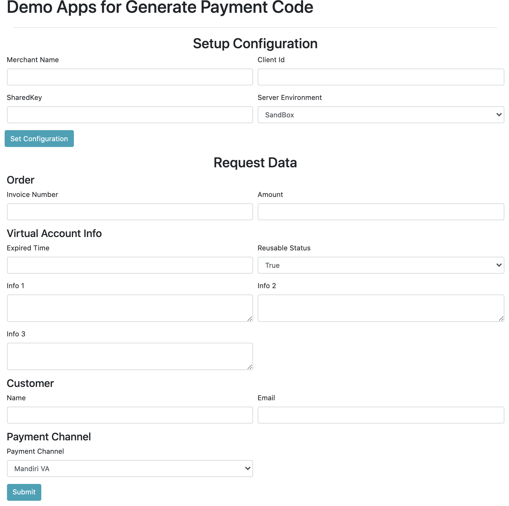
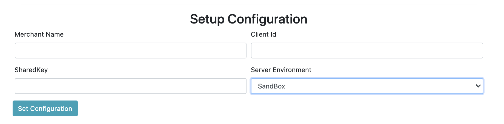
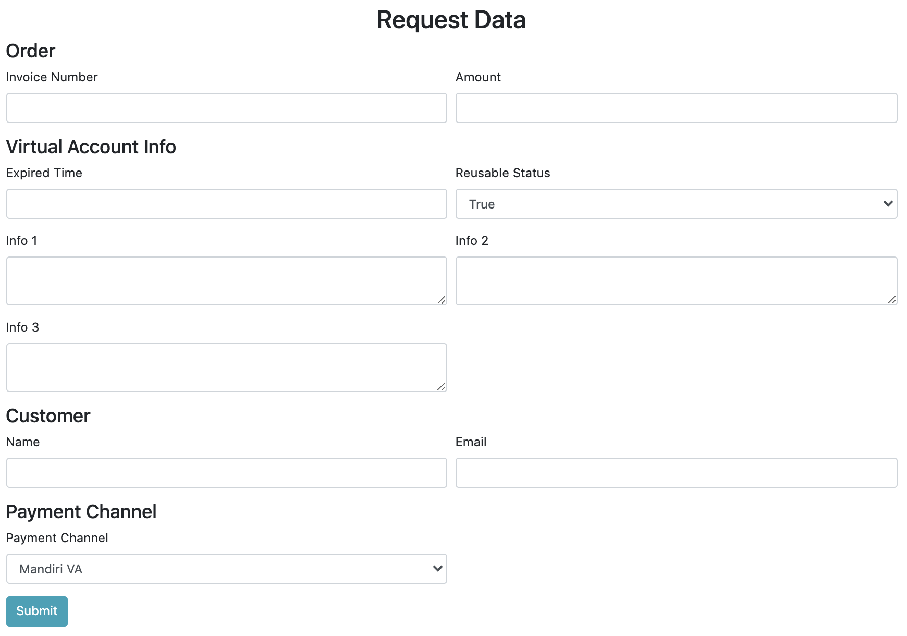
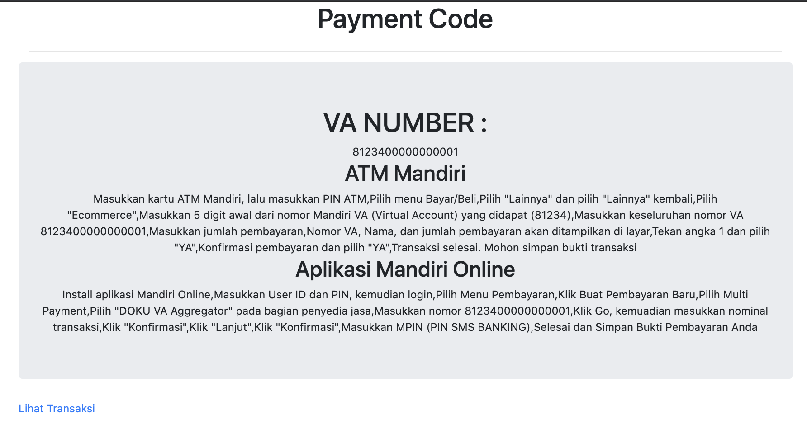

# Jokul Java Example

Official Demo Application for Java Library for [Jokul Java Library](https://github.com/PTNUSASATUINTIARTHA-DOKU/jokul-java-library). Visit [https://jokul.doku.com](https://jokul.doku.com) for more information about the product and [https://jokul.doku.com/docs](https://jokul.doku.com/docs) for the technical documentation.

## Requirements

Java 11 or above

## Running Application

Run this command :
```
mvn spring-boot:run 
```
This application will run in port 8080, you will see the Demo App:



## Demo Application

### Setup Configuration

This part is filled with merchant configuration that you can retrieve from [Jokul Back Office](https://jokul.doku.com/bo/login). **IMPORTANT** never use production credential for testing purpose since it will generate a real transaction.



### Request Data

This part is filled with customer data transaction that will proceed on Jokul.



### Generate Paycode

This page shows paycode generated that customers need to pay. Furthermore, you can simulate the payment through our simulator. Learn more [here](https://jokul.doku.com/docs).



### Transaction List

This page shows list of transaction.


## Help and Support

Got any issues? Found a bug? Have a feature requests? You can [open new issue](https://github.com/PTNUSASATUINTIARTHA-DOKU/jokul-java-example/issues/new).

For further information, you can contact us on [care@doku.com](mailto:care@doku.com).
