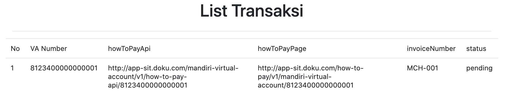

# Jokul Java Example

Official Demo Application for Java Library for [Jokul Java Library](https://github.com/PTNUSASATUINTIARTHA-DOKU/jokul-java-library). Visit [https://jokul.doku.com](https://jokul.doku.com) for more information about the product and [https://jokul.doku.com/docs](https://jokul.doku.com/docs) for the technical documentation.

## Requirements

Java 11 or above

## Running Application
Run this command :
```
mvn spring-boot:run 
```
This application will run in port 8080, and will show Demo :


## Demo Application
### Setup Configuration
This part is filled by data identity merchant and credential data of merchant that DOKU Core need. 


### Request Data
This part is fill by customer data transaction that will proceed on DOKU Core. 


### Generate Paycode
This page is a result of generated paycode. 


### List Transactiion
This page show is list of transaction. 


Please refer to this repo for the example project: [Jokul Java Example](https://github.com/PTNUSASATUINTIARTHA-DOKU/jokul-java-example).

## Help and Support

Got any issues? Found a bug? Have a feature requests? You can [open new issue](https://github.com/PTNUSASATUINTIARTHA-DOKU/jokul-java-library/issues/new).

For further information, you can contact us on [care@doku.com](mailto:care@doku.com).
